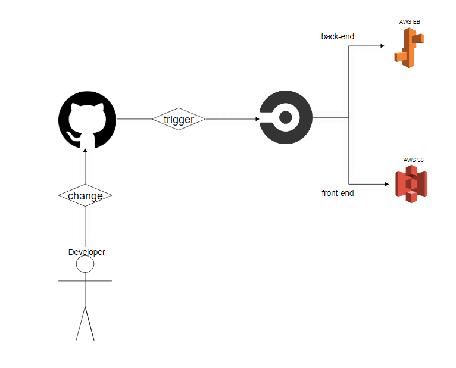

# Pipeline process

* Install all dependencies for the Back-End.
* Build Back-End app.
* Deploy the Back-End build to Elastic Beanstalk.

* Install all dependencies for the Front-End .
* Run tests for the Front-End.
* Build the Front-End app.
* Deploy the Front-End app to the bucket s3.

# ENV variables
must be in the CircleCI project env
```
POSTGRES_HOST
PORT
DB_PORT
POSTGRES_DB
POSTGRES_PASSWORD
POSTGRES_USERNAME
AWS_REGION
AWS_PROFILE
AWS_BUCKET
URL
JWT_SECRET
AWS_ACCESS_KEY_ID
AWS_DEFAULT_REGION
AWS_SECRET_ACCESS_KEY
```

# Circleci Pipeline

