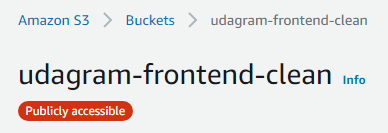

# Udagram

## Documentation
<a href="/Documentation/">Docs</a>

## URL
* App url: http://udagram-frontend-clean.s3-website-us-east-1.amazonaws.com/

## App Health

* RDS  

* EB  

* S3  

* CircleCI  

# Built With
* Node 
* Angular
* typescript
